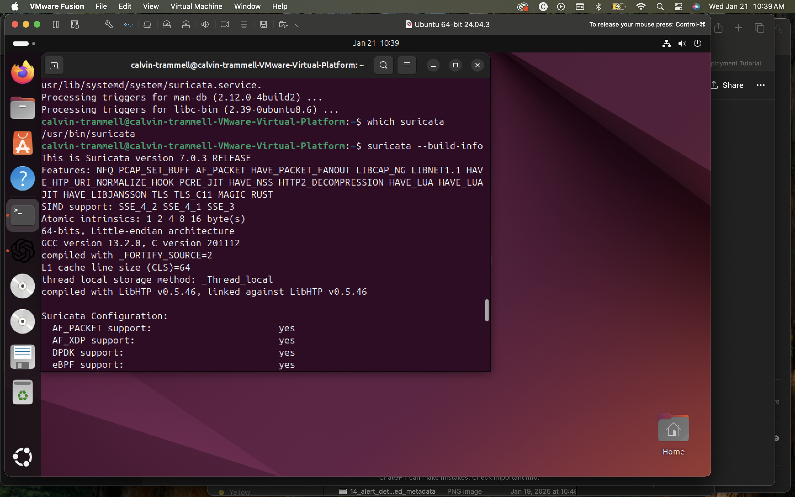
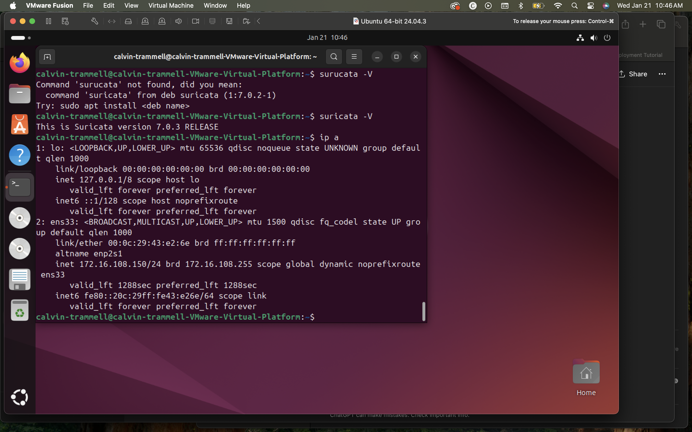
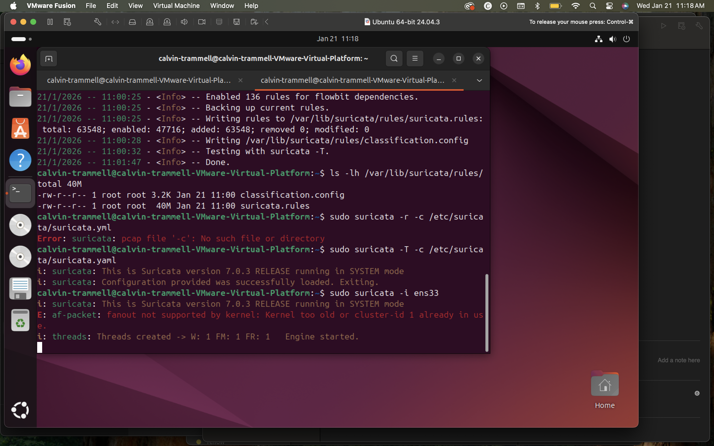
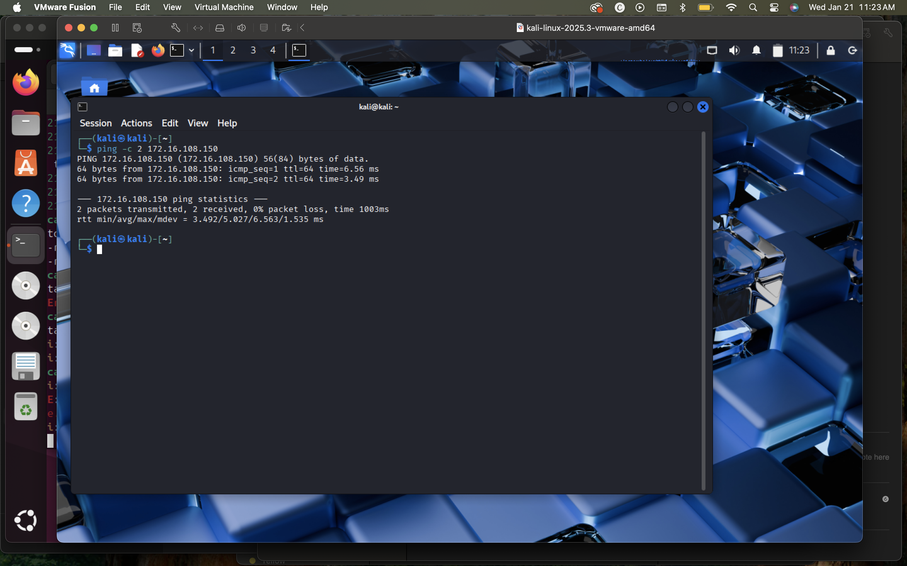
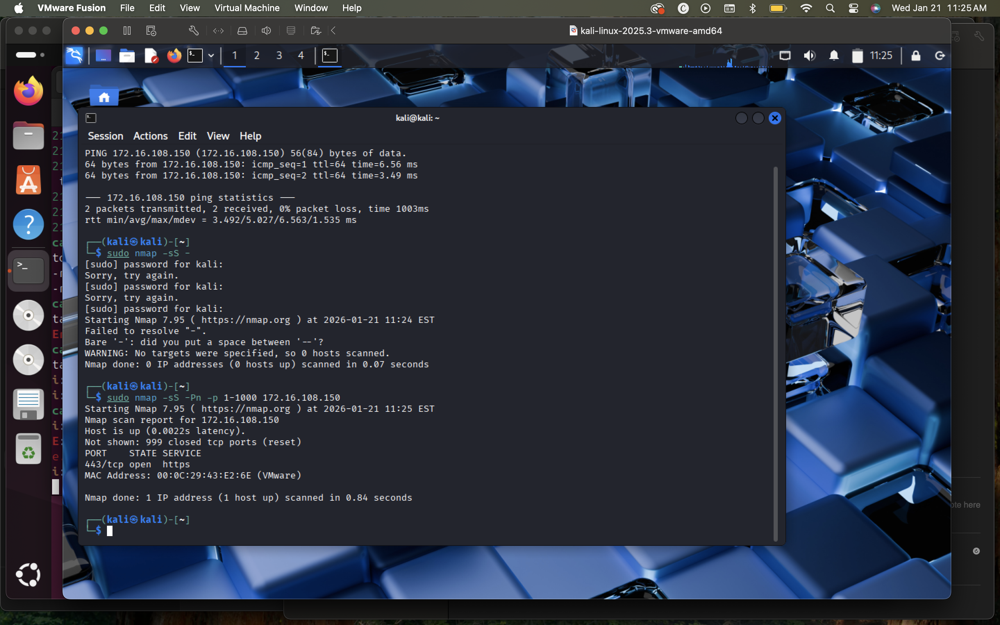
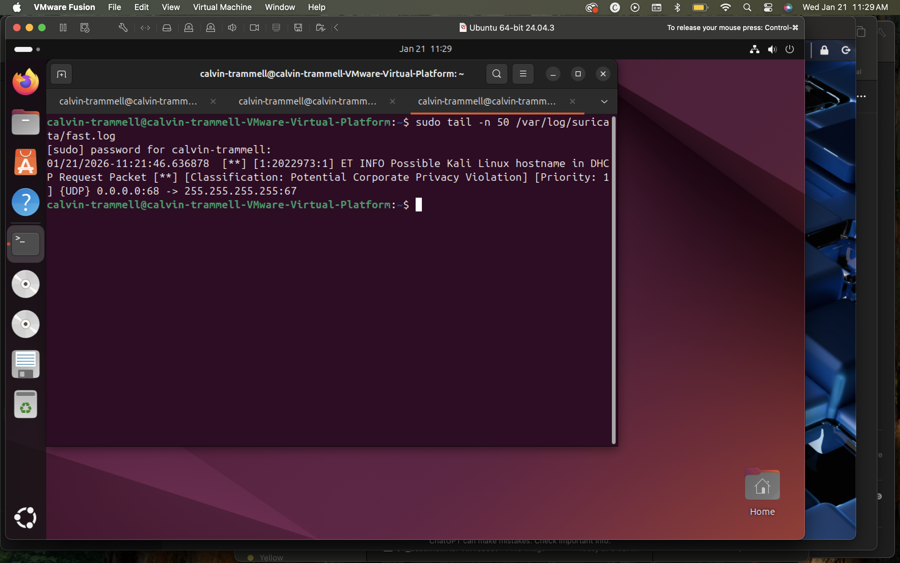

# IDS Deployment & Packet Analysis (Suricata)

## Overview
This project demonstrates deploying and validating a network Intrusion Detection System (IDS) using **Suricata** on Ubuntu. Attack and reconnaissance traffic was generated from a **Kali Linux** host and analyzed through Suricata alert logs.

## Lab Environment
- **IDS Sensor:** Ubuntu 24.04 with Suricata
- **Attacker:** Kali Linux
- **Hypervisor:** VMware Fusion
- **Network:** Isolated host-only lab network

## Tools Used
- Suricata
- Kali Linux
- Nmap
- Ubuntu Linux
- VMware Fusion

## Project Steps
1. Installed and verified Suricata build features and packet capture support.
2. Identified the correct monitoring interface on the IDS sensor.
3. Updated and enabled Emerging Threats Open rules.
4. Started Suricata in IDS mode and validated rule loading.
5. Generated reconnaissance traffic from Kali Linux.
6. Confirmed IDS alert generation using Suricata logs.

## Evidence

### Suricata Build Verification

### Sensor Interface Configuration

### IDS Running with Rules Loaded

### Kali to IDS Connectivity

### Reconnaissance Traffic (Nmap Scan)

### Suricata Alert Evidence

## Resume Highlights
- Deployed and configured a Suricata IDS sensor to monitor live network traffic.
- Simulated reconnaissance activity from a Kali Linux host using Nmap.
- Validated IDS alert generation and reviewed Suricata fast.log entries.
- Demonstrated SOC Tier 1 workflows including sensor validation, rule management, and alert triage.
